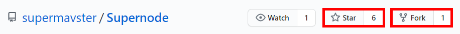

# Supernode - Documentación

> Node template (Typescript, Express, Sequelize TS y modelo Repositorio)

[](https://www.npmjs.com) [](https://github.com/supermavster/supernode/releases/latest)  [](https://github.com/supermavster/supernode/blob/master/LICENSE)  [](https://github.com/supermavster/supernode/issues?q=is%3Aissue+is%3Aopen+label%3A%22help+wanted%22) [](https://github.com/supermavster)

**¡Ya no necesitas empezar tu proyecto Backend desde cero!**


# 🚩 Tabla de contenido

[TOCM]

[TOC]

# Introducción


Esta es una útil, estructurada y compatible plantilla de Stack o Backend para **NODE**.

Hecho con las principales tecnologías como: *Express, Sequelize, Jest y Node Server usando TypeScript*.

# Comenzando 🚀

Sigue los siguientes pasos para utilizar y construir tus proyectos con base en este stack:

Realiza **fork** de este repositorio en tú cuenta.


O bien, puedes clonarlo directamente:
```shell
$ git clone https://github.com/supermavster/supernode.git
```

# Pre-requisitos 📋

Para poder utilizar este template, necesita tener instalado:
- Terminal
- NodeJS
- YARN
- Gestor de Base de datos
- Docker (Opcional)

Notas: 

**Terminal**
Para la terminal perfectamente puedes usar la terminal de [GIT](https://git-scm.com/ "GIT") o si quieres ser un poco más profesional usar [Windows Subsystem for Linux (WSL) ](https://www.neoguias.com/activar-terminal-linux-windows-10/ "Windows Subsystem for Linux (WSL)")

**NodeJS**
Instalalo y descargalo en su versión más estable en el siguiente link: [NodeJS](https://nodejs.org/en/ "NodeJS") al instalar node trata de ejecutar **Install Additional Tools for Node.js** con el fin de poder tener todos los elementos necesarios para la ejecución de NodeJS.

**Yarn**
Instalalo y descargalo en su versión más estable en el siguiente link: [Yarn](https://yarnpkg.com/ "Yarn") , con el fin de ejecutar comandos más rapidamente y un tanto más estructurado.

**Gestor de Base de datos**
Por preferencia MySQL, o puedes escoger entre las siguientes: *Postgres, MySQL, MariaDB, Sqlite3 y Microsoft SQL Server*

**Docker** (Opcional)
Creación del gestor de base de datos e inclusivde ejecución de Node.


# Instalación 🔧

Para la configuración de la instalación del mismo, debemos configurar los environments e instalar dependencias, para que podamos ejecutar el stack.


## Instalación de Dependencias

Ahora necesitamos instalar las dependencias del proyecto, utilizando alguno de los siguientes comandos:
```shell
$ npm install
```
or
```shell
$ yarn install
```

## Configuración
Necesitas añadir las variables de entorno, las cuales nos permitiran conectarnos a las bases de datos ofrecidas por Sequelize, al igual toda credencial que tengamos.

Para esto un ejemplo de un archivo env en la carpeta `environment`; más especifico `environment/.env.example`

```shell
$ cd environment
$ cp .env.example .env.local && cp .env.example .env.development && cp .env.example .env.production
```
Un ejemplo base del archivo `.env.development` seria:

```
##################
# Env File
##################

ENV=development
VERSION=1
PROJECT=supernode
SHORT_NAME=sn
LANGUAGE=es

#HOST DATA:
HOST=localhost
PORT=5000

## DATABASE DATA
# DEV
DEV_DB_USERNAME=root
DEV_DB_PASSWORD=secret
DEV_DB_NAME=test
DEV_DB_HOSTNAME=127.0.0.1
DEV_DB_SYSTEM=mysql
DEV_DB_PORT=33060

GMAIL_SERVICE_NAME=gmail
GMAIL_SERVICE_HOST='smtp.gmail.com'
GMAIL_SERVICE_SECURE=true
GMAIL_SERVICE_PORT=465
GMAIL_USER_NAME=correo@gmail.com
GMAIL_USER_PASSWORD=secret
```


## Ejecutar el APP
**Warning! Debe de ejecutarse la base de datos antes de proseguir**

Si utilizas **docker** te recomiendo que montes y ejecutes un volumen con mysql, más información: [Docker + MySQL (Tutorial)](https://platzi.com/tutoriales/1432-docker/3268-como-crear-un-contenedor-con-docker-mysql-y-persistir-la-informacion/), despues de crear el volumen ejecutar el id o nombre del contenedor: `docker start be04f0c06...`

---
**Ejemplos de uso:**

Un ejemplo ejecutado con las credenciales en `local`, seria:

```shell
$ npm run dev:local
```
o
```shell
$ yarn dev:local
```

Dando como respuesta de servidor: http://localhost:5000/

---
***Development***

Un ejemplo ejecutado con las credenciales en `development`, seria:

```shell
$ npm run dev:development
```
o
```shell
$ yarn dev:development
```

O de manera corta, con la ejecución de `Nodemon`:

```shell
$ npm run dev
```
o
```shell
$ yarn dev
```


**Nota:** Configurar el archivo `.env.development` para la ejecución de este comando.


---
Un ejemplo ejecutado con las credenciales en `production`, seria:

```shell
$ npm run dev:production
```
o
```shell
$ yarn dev:production
```
---

La plantilla admite cuatro entornos, puede modificarlos desde pakcage.json > scripts
npm install. 

Por ejemplo, ejecute la plantilla `npm run serve:local`, para ejecutar la aplicación utilizando el modo de entorno local.

# Características 🎨
- Ejemplo completo de llamada API (para que pueda rastrearlo y saber cómo funciona el ciclo de vida de la llamada API).
- Uso de Typescript.
- Configurar entorno de prueba utilizando pruebas Jest con informes de cobertura. (In Progress)
- Estructura: Controlador, Servicio, Repositorio y Modelo.
- Validación de modelos de bases de datos.
- Eslint linting, Pettrier y Babel.
- Corrección automática para errores de linting antes de confirmar cambios.
- Soporte de múltiples entornos.
- Soporte de múlti lenguaje.
- Un lugar para manejar errores.
- Manejo de errores usando el módulo Hapi / Boom (errores consistentes y estructurados).
- Manejo de Interfaces
- Creación de Migraciones Estructuradas.
- Creación de Seeders Estructurados.
- Ejemplos: CRUD y CRUD con archivos.
- Incorporación completa.
- Envío de correos electrónicos personalizados.
- Compilación con Babel en TS y configuración de la misma.
- Verificación y limpieza del código con ESLint y Pettrier usando TS.
- Generación automática de documentación en el Swagger
- Configuración del insomnio y servicios de pila
- Recopilación y ejecución
- Despliegue y configuración - *BitButcket*
- Y mucho más...

**Nota:** Se puede extender a más idiomas y escalar.

# Despliegue 📦

PENDING

# Construido con 🛠️

Este proyecto fue creado usando las siguientes tecnologias:
- NodeJS
- Yarn
- Express
- Typescript
- Sequelize (and Sequelize TypeScript)
- Hapi/Boom
- Husky
- ESLint
- Prettier
- Nodemon or PM2
- HTTP Status Code
- Swagger
- Jest (in progress)

# Wiki 📖

Puedes encontrar mucho más de cómo utilizar este proyecto en nuestra [Wiki](https://github.com/supermavster/supernode/wiki)

# Versionado 📌

Usamos [SemVer](http://semver.org/) para el versionado. Para todas las versiones disponibles, mira los [tags en este repositorio](https://github.com/supermavster/supernode/tags).

# Contribución ✒️
Puedes mirar la lista de todos los [contribuyentes](https://github.com/supermavster/supernode/contributors) quíenes han participado en este proyecto. 

# Licencia 📜

Este proyecto está bajo la Licencia (MIT) - mira el archivo [LICENSE.md](LICENSE.md) para detalles. Supernode - ©[Supermavster](https://github.com/Supermavster).

# Expresiones de Gratitud 🎁

* Comenta a otros sobre este proyecto 📢
* Invita una cerveza 🍺 o un café ☕ a alguien del equipo. 
* Da las gracias públicamente 🤓.
* etc.


#  Developers 🚀
|  <br/> Miguel Ángel|
|---------------------------------------------------------------------------------------------------------------------|
| <div align="center"> <a href="https://github.com/supermavster">  </a> <a href="https://www.linkedin.com/in/miguel-angel-torres-vargas/">  </a>                                                     |


---
⌨️ con ❤️ por [Supermavster](https://github.com/Supermavster) 😊